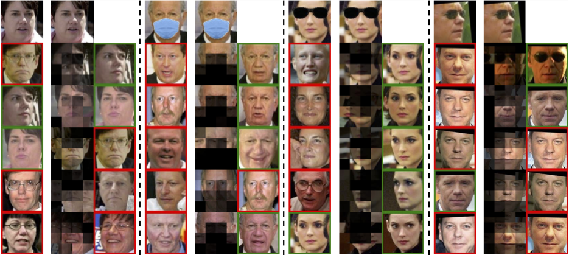

## DeepFace-EMD: Re-ranking Using Patch-wise Earth Mover’s Distance Improves Out-Of-Distribution Face Identification

`Official Implementation` for the paper "DeepFace-EMD: Re-ranking Using Patch-wise Earth Mover’s Distance Improves Out-Of-Distribution Face Identification" , by Hai Phan and Anh Nguyen.

 
 

## Requirements
```
Python >= 3.5
Pytorch > 1.0
Opencv >= 3.4.4
pip install tqmd
```

## Download datasets and pretrained models

1. Download LFW, out-of-distribution of LFW, and pretrained models: [Google Drive](https://drive.google.com/drive/folders/1hoyO7IWaIx2Km-pe4-Sn2D_uTFNLC7Ph)

2. Create the following folders:

```
mkdir data
mkdir pretrained
```

3. Extract LFW datasets (e.g. `lfw_crop_96x112.tar.gz`) to `data/`
4. Copy models (e.g. `resnet18_110.pth`) to `pretrained/` 

## How to run 
 
1. Run small examples
- Run testing LFW images
  +  `-mask -sunglass -crop`: enable ood face data as query data.
```
bash run_test.sh
```

- Run demo: The demo gives results of top-5 images of stage 1 and stage 2 (including flow visualization of EMD).
  + `-mask`: input an normal face image in database, masked image is a query image.
  + `-sunglass` and `-crop`: similar.   
```
bash run_demo.sh
```
2. Run full exmaples

- Change `args.data_folder` to `data` in `.sh` files.

## Run visualization with two images

```
python visualize_faces.py -method [methods] -fm [face models] -model_path [model dir] -in1 [1st image] -in2 [2nd image] -weight [1/0: showing weight heatmaps] 
```
 
 

## Modify with your own dataset.
1. Facial alignment. See [align_face.py](alignment/align_face.py) for details.
- Install [face_alignment](https://github.com/1adrianb/face-alignment) to extract landmarks. 
```
pip install scikit-image
pip install face-alignment

```
- For making face alignment with size of `160x160` for Arcface (`128x128`) and FaceNet (`160x160`), the reference points are as follow (see function `alignment` in [align_face.py](alignment/align_face.py)).
```python
ref_pts = [ [61.4356, 54.6963],[118.5318, 54.6963], [93.5252, 90.7366],[68.5493, 122.3655],[110.7299, 122.3641]]
crop_size = (160, 160)
```

2. Create a folder including all persons (folders: name of person) and put it to '/data' 
3. Create a `txt` file with format: `[image_path],[label]` of that folder (See [lfw file](data_files/full/lfw_128.txt) for details)
4. Modify [face loader](data_loader/facedata_loader.py): Add your `txt` file in function: `get_face_dataloader`. 


## References
1. W. Zhao, Y. Rao, Z. Wang, J. Lu, Zhou. Towards interpretable deep metric learning with structural matching, ICCV 2021 [DIML](https://github.com/wl-zhao/DIML)
2. J.  Deng,   J. Guo,   X. Niannan,   and   StefanosZafeiriou.   Arcface:  Additive angular margin loss for deepface recognition, CVPR 2019 [Arcface Pytorch](https://github.com/ronghuaiyang/arcface-pytorch)
3. H.  Wang,  Y. Wang,  Z. Zhou,  X. Ji,  DihongGong,  J. Zhou,  Z. Li,  W. Liu.   Cosface: Large margin cosine loss for deep face recognition, CVPR 2018 [CosFace Pytorch](https://github.com/MuggleWang/CosFace_pytorch)
4. F. Schroff,  D. Kalenichenko, J. Philbin. Facenet: A unified embedding for face recognition and clustering. CVPR 2015 [FaceNet Pytorch](https://github.com/timesler/facenet-pytorch)
5. L. Weiyang, W. Yandong, Y. Zhiding, L. Ming, R. Bhiksha, S. Le. SphereFace: Deep Hypersphere Embedding for Face Recognition, CVPR 2017 [sphereface](https://github.com/wy1iu/sphereface), [sphereface pytorch](https://github.com/clcarwin/sphereface_pytorch)
6. Chi Zhang, Yujun Cai, Guosheng Lin, Chunhua Shen. Deepemd: Differentiable earth mover’s distance for few-shotlearning, CVPR 2020 [paper](https://arxiv.org/pdf/2003.06777.pdf)